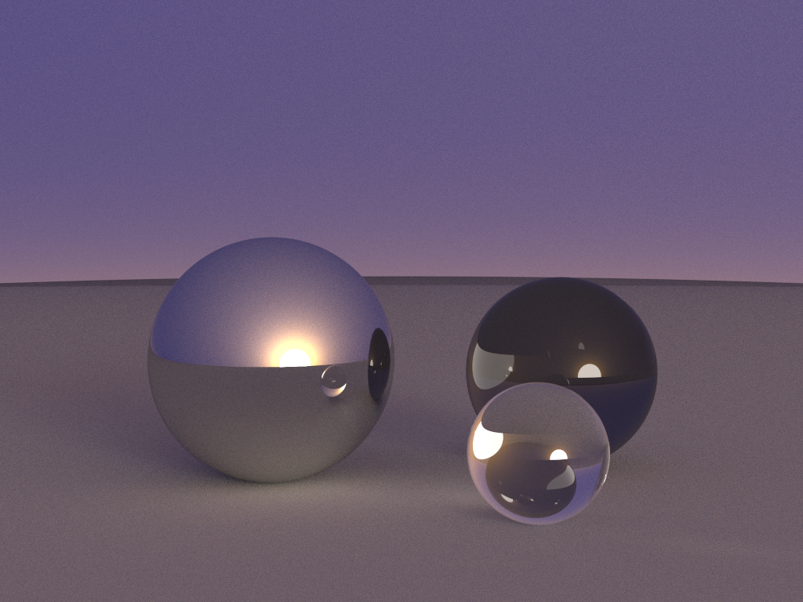

# Radium

Radium is a Ray Tracing Engine written in C++ that runs on the CPU using shared-memory multiprocessing. Frames rendered by Radium are saved in PPM format.

## Features

- Simple and easy-to-use API.

- Global illumination using Unbiased Monte Carlo Path Tracing.

- Soft shadows from Diffuse Light Sources.

- Specular, Diffuse, and Refractive Materials are supported.

- Total Internal Reflection for Refractive Materials.

- Russian Roulette for path termination.

**Note:** Radium has been tested on MacOS and Linux. Support for Windows is Experimental.

## Instructions

- `git clone --recursive https://github.com/soumik12345/Radium`

- `sh ./install.sh` in order to install the python dependencies.

- Make sure you have CMake installed for your system.

- Edit to include the engine code `src/main.cpp`.

- `sh ./build_and_run.sh`

- In order to run Radium on Google Colab, refer to 

## Demos

### Simple Cornell Box with a Specular and Refractive Sphere

Rendered at 5000 samples per pixel and took 100 minutes to render on Intel Core i5 8th Gen.

### Demo 1

Rendered at 5000 samples per pixel and took 91 minutes to render on Intel Core i5 8th Gen.

### Demo 2

Rendered at 40 samples per pixel and took 2 minutes and 25 seconds to render on Intel Core i5 8th Gen.

### Demo 3

Rendered at 200 samples per pixel and took 4 minutes and 15 seconds to render on Intel Core i5 8th Gen.

### Demo 4

Rendered at 5000 samples per pixel and took 71 minutes to render on Intel Core i5 8th Gen.
